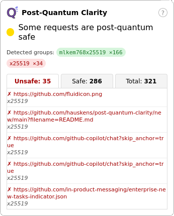

# Post-Quantum Clarity
A simple open-source Firefox extension to help raise awareness of sites that use unsafe key exchange algorithms.
It will simply look at what key exchange algorithm used on https requests.

# Disclaimer
LLM have been used to make this extension, tested by a human.
You can visit https://pq.cloudflareresearch.com to see a post-quantum secure site.

# License
MIT